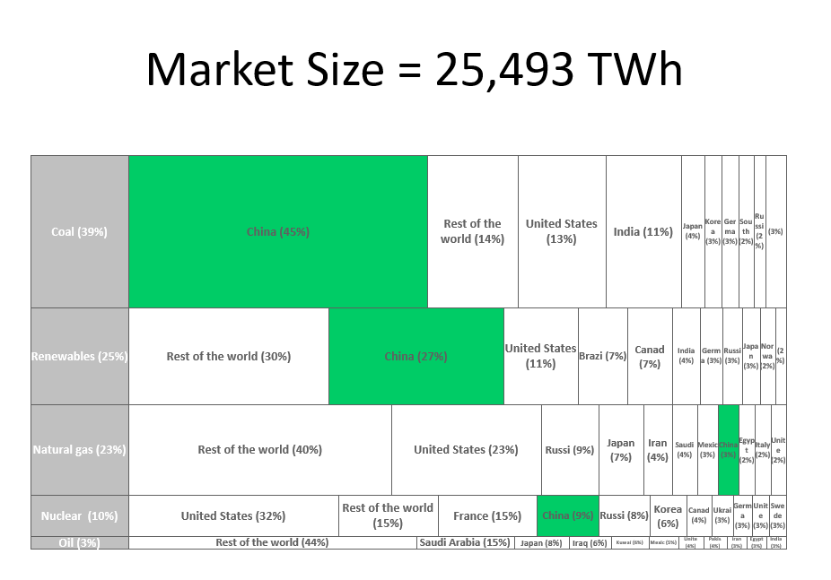

# list2marimekko
generating business graphs from data list

[](https://mybinder.org/v2/gh/gbrault/list2marimekko/master?filepath=Power%2FPower.ipynb)

Create a powerpoint slide given a data list see the Power example
```
| index | TWh 2017 EIA | Attribut    | Share |
| 0     | Australia    | Coal        | 162   |
| 1     | Brazil       | Renewables  | 466   |
| 2     | Canada       | Renewables  | 432   |
| 3     | Canada       | Nuclear     | 101   |
| 4     | China        | Coal        | 4485  |
| 5     | China        | Natural gas | 183   |
| 6     | China        | Renewables  | 1662  |
| 7     | China        | Nuclear     | 248   |
.....
```


